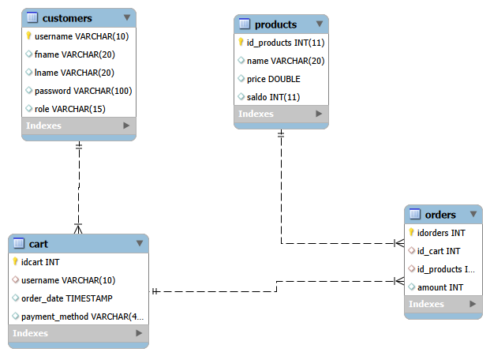

# REST API esimerkki

Tämän REST API esimerkin aiheena on OnlineStore eli verkkokauppa. Tätä ei ehditä tehdä kurssin aikana valmiiksi. Tarkoitus on saada aikaan seuraavat toiminnat:

- Tietokannassa customers taulu ja sille REST APIssa kaikki CRUD operaatiot
- custemers taulussa olevat salasana hashataan **bcrypt** algoritmilla
- API:in toteutetaan login systeemi, jossa onnistunut kirjautuminen palauttaa **webtokenin**
- Joitakin endpointteja suojataan, niin että niihin pääsee vain sopivalla webtokenilla

## Sovelluksen rakenne

Sovellus perustuu MVC malliin ja tässä käytetään yksikertaista versiota:

- routes kansiossa on ns. kontrollerit, jotka on nimetty tietokantataulujen mukaan 
    - customers.js
    - products.js
- models kansiossa on ns. modelit, jotka on nimetty kontrollereita vastaavasti
    - customers_model.js
    - products_model.js

- lisäksi routes kansiossa on **login.js** tiedosto

## app.js

Tämän sovelluksen ns. **Entry point** on app.js tiedosto.

## .env

Tämä tiedosto määrittelee sovelluksen käyttämät ympäristömuuttujat. Sinne laitetaan esimerkiksi JWT-salaisuusavain ja tietokantapalvelimen yhteystiedot. Tiedostoa ei tule lisätä versionhallintaan, koska se sisältää luottamuksellista tietoa. Projektissa on mukana mallitiedosto **.env.example**, joka näyttää, mitä muuttujia sovellus tarvitsee ja millaisessa muodossa ne tulee määritellä.

Tässä esimerkissä .env tiedostoon tulee MY_TOKEN, jonka arvoa **jwt.sign** käyttää tokenin signature osan laskemiseen.

## Sovelluksen asentaminen 

- Kloonaa sovellus
- Kopio tiedosto .env_example tiedostoksi .env
- Luo tietokanta tiedoston sqlcode.txt avulla
- Suorita komento **npm install**
- Sovellus käynnistyy komennolla **node app.js**

**Huom!** Jotta saat luotua customer-tauluun tunnuksia on sinun kommentoitava app.js tiedoston rivi: "app.use(authenticateToken);"

## Tietokannan ER-malli

